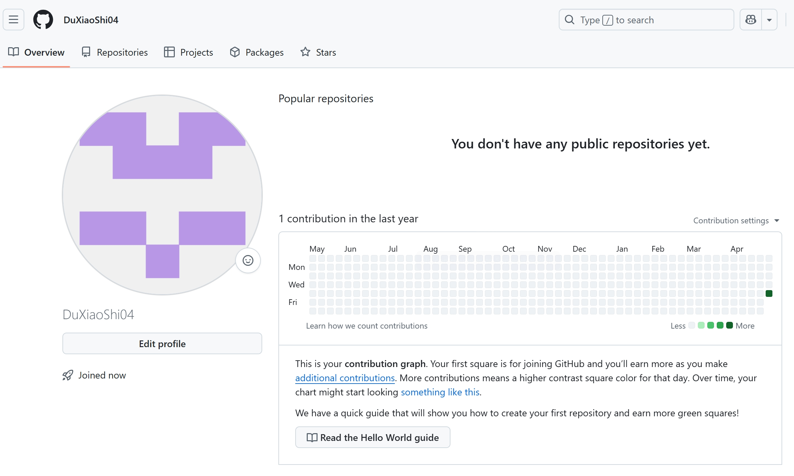

# 🚀 DoCode 营开发环境搭建教程

## ✅ Step 1：注册 GitHub 账号

📍网站地址：[https://github.com/](https://github.com/)

注册流程截图如下：




📦 项目地址：[caoye04/DoCodeClub: 笃实书院第一届 DoCode 营的小项目](https://github.com/caoye04/DoCodeClub)

---

## ✅ Step 2：开发环境搭建与基础教程

本教程将介绍 Git、Anaconda 和 Python 的安装与使用，帮助你快速上手项目开发。

---

## 🔧 一、Git 安装与基本使用

### 1.1 什么是 Git？

Git 是一个分布式版本控制系统，能帮助我们记录代码的历史变更、多人协作开发并轻松回滚到任意版本。**GitHub 是基于 Git 的代码托管平台。**

### 1.2 Git 安装

#### 📌 Windows 系统：

1. 打开官网 [https://git-scm.com/](https://git-scm.com/)，点击下载最新版；
2. 双击安装包，**一路“下一步”即可**（保持默认设置）；
3. 安装完成后，右键桌面空白处，选择 `Git Bash Here` 测试是否安装成功。

#### 📌 macOS 系统（需先安装 Homebrew）：

```bash
brew install git
```

#### 📌 Linux 系统（Debian/Ubuntu）：

```bash
sudo apt update
sudo apt install git
```

### 1.3 Git 配置（首次使用）

```bash
git config --global user.name "你的GitHub用户名"
git config --global user.email "你的GitHub注册邮箱"
```

### 1.4 Git 常用命令

| 命令 | 作用 |
|------|------|
| `git init` | 初始化本地 Git 仓库 |
| `git clone <仓库地址>` | 克隆远程仓库到本地 |
| `git status` | 查看当前状态（改了哪些文件） |
| `git add .` | 添加所有修改到暂存区 |
| `git commit -m "提交说明"` | 提交修改并写入说明 |
| `git push` | 推送本地修改到 GitHub |
| `git pull` | 拉取远程仓库最新内容 |

### 1.5 如何推送作业到 GitHub？

1. 点击项目页面右上角的 **Fork** 按钮，将项目复制到你的 GitHub；
2. 使用以下命令将项目拉取到本地：

   ```bash
   git clone https://github.com/你的用户名/DoCodeClub.git
   ```

3. 在 `hw` 文件夹内创建你的作业目录；
4. 使用以下命令提交并推送：

   ```bash
   git add .
   git commit -m "添加我的作业"
   git push origin main
   ```

5. 回到 GitHub，点击 **"Compare & pull request"** 提交 PR。

---

## 🐍 二、Anaconda 安装与使用

### 2.1 Anaconda 是什么？

Anaconda 是一个集成了 Python、数据科学工具和包管理器（conda）的开发套件。它能：

- 快速创建隔离的虚拟环境；
- 管理不同版本的 Python 和库；
- 自带很多常用科学计算库。

### 2.2 安装 Anaconda

1. 打开官网：[https://www.anaconda.com/products/distribution](https://www.anaconda.com/products/distribution)
2. 根据操作系统下载对应版本；
3. 安装时建议勾选：

   - ✅ Add Anaconda to my PATH（可选）
   - ✅ Register Anaconda as default Python（推荐）

安装完成后，打开终端或 Anaconda Prompt，输入：

```bash
conda --version
```

若成功显示版本号，则表示安装成功。

### 2.3 创建与管理虚拟环境

#### ✅ 创建新环境：

```bash
conda create -n myenv python=3.10
```

#### ✅ 启动环境：

```bash
conda activate myenv
```

#### ✅ 退出当前环境：

```bash
conda deactivate
```

#### ✅ 删除环境：

```bash
conda remove -n myenv --all
```

#### ✅ 查看所有环境：

```bash
conda env list
```

### 2.4 安装常用库

使用 Conda 安装（推荐）：

```bash
conda install numpy pandas matplotlib
```

也可以用 pip：

```bash
pip install requests flask
```

---

## 🐍 三、Python 基本使用

### 3.1 运行 Python 脚本

创建文件 `hello.py`：

```python
print("Hello, Python!")
```

在终端运行：

```bash
python hello.py
```

### 3.2 Python 基础语法示例

```python
# 变量
x = 10
name = "Alice"

# 条件语句
if x > 5:
    print("x is greater than 5")

# 循环
for i in range(3):
    print(i)

# 函数
def greet(user):
    return f"Hello, {user}!"

print(greet("Bob"))

# 列表和字典
fruits = ["apple", "banana"]
person = {"name": "Tom", "age": 22}
```

### 3.3 安装模块

```bash
pip install 包名
pip install -r requirements.txt
```

---

## 🧱 四、项目结构简介

项目代码示例结构如下：

```
code/
├── README.md           # 项目说明
├── .gitignore          # Git忽略文件
├── app.py              # 主程序入口
├── requirements.txt    # 项目依赖列表
├── config.py           # 配置项
├── static/             # 静态资源（CSS/JS/图片等）
├── templates/          # HTML模板
├── core/               # 项目核心模块
```

---

## 📝 五、作业提交要求

1. 在 GitHub 上 fork 本项目；
2. 克隆到本地后，在 `hw/` 目录中新建以自己名字命名的文件夹；
3. 添加作业内容后提交 `pull request` 到主仓库。
