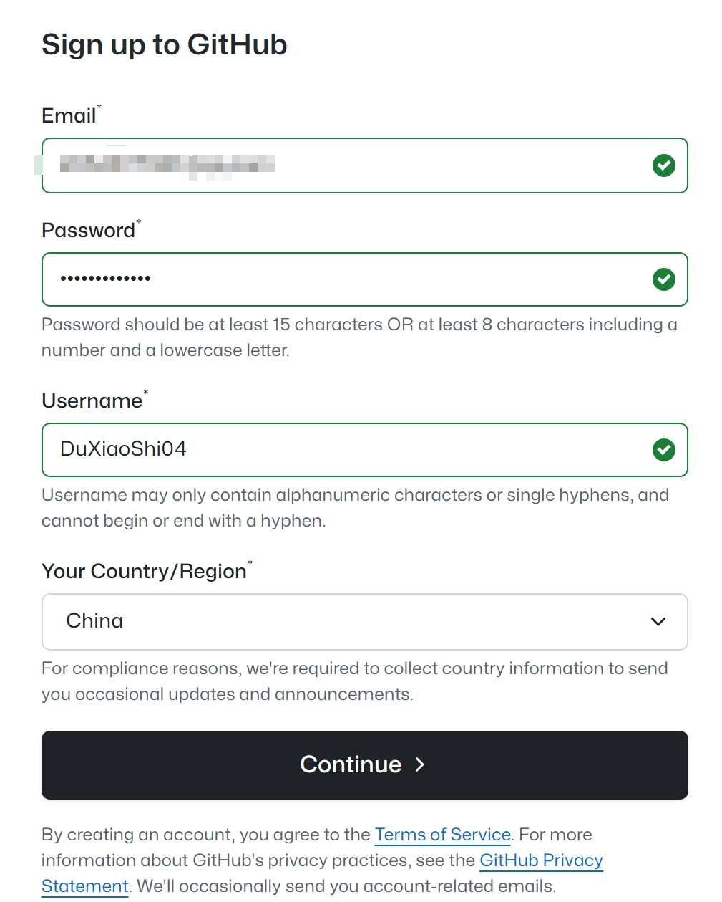
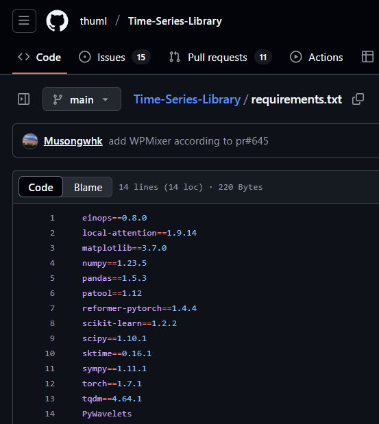
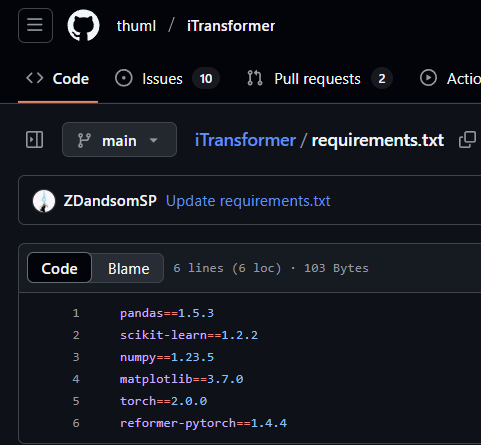

# 1st Docode Club Lab1：项目认知与环境搭建 

[toc]

## Step 1：注册 GitHub 账号

网站地址：[https://github.com/](https://github.com/)




项目地址：[caoye04/DoCodeClub: 笃实书院第一届 DoCode 营的小项目](https://github.com/caoye04/DoCodeClub)

GitHub 是全球最大的代码托管平台，也是开发者社区，提供代码版本控制、协作开发和项目管理功能。注册账号是参与 DoCode 营项目的第一步。

---

## Step 2：Git 安装与基本使用

### Step 2.1 什么是 Git？

Git 是目前最流行的分布式版本控制系统，它能够:
- 跟踪代码变更历史
- 支持多人协作开发
- 提供强大的分支管理功能
- 轻松回溯到任意历史版本


GitHub 是基于 Git 技术的代码托管平台，为我们提供了项目管理、代码审查和团队协作的功能。

### Step 2.2 Git 安装

**Windows 系统：**

1. 访问 Git 官网 [https://git-scm.com/](https://git-scm.com/)，下载最新版安装包
2. 运行安装程序，按默认设置一路"下一步"即可完成安装
3. 验证安装：在桌面空白处右键，选择"Git Bash Here"，输入 `git --version` 查看版本号

**macOS 系统：**

使用 Homebrew 安装（如未安装 Homebrew，请先访问 [https://brew.sh/](https://brew.sh/) 安装）：
```bash
brew install git
```

**Linux 系统（Debian/Ubuntu）：**

```bash
sudo apt update
sudo apt install git
```

### Step 2.3 Git 首次配置

安装完成后，需要设置你的身份信息（用于记录代码提交者）：

```bash
git config --global user.name "你的GitHub用户名"
git config --global user.email "你的GitHub注册邮箱"

// 用于验证
git config --list
//你应当可以看到你的用户名和邮箱
```

### Step 2.4 生成SSH密钥并绑定到GitHub

使用SSH密钥可以让你无需每次都输入用户名和密码，就能安全地与GitHub仓库进行通信。步骤如下：

**1. 生成SSH密钥**

在终端或Git Bash中运行：

```bash
ssh-keygen -t ed25519 -C "你的GitHub邮箱"
```

> 注意：如果你使用的是较旧的系统不支持Ed25519算法，可以使用：
>
> ```bash
> ssh-keygen -t rsa -b 4096 -C "你的GitHub邮箱"
> ```

执行过程中会询问：

- 密钥保存位置（建议使用默认路径，直接按Enter）
- 是否设置密码（可以设置，也可以留空直接按Enter）

**2. 查看并复制公钥**

```bash
# Windows/Linux
cat ~/.ssh/id_ed25519.pub
# 或者 cat ~/.ssh/id_rsa.pub（如果使用的是RSA密钥）

# macOS
pbcopy < ~/.ssh/id_ed25519.pub
# 或者 pbcopy < ~/.ssh/id_rsa.pub（如果使用的是RSA密钥）
```

Windows用户也可以直接打开文件`C:\Users\你的用户名\.ssh\id_ed25519.pub`查看内容。

**3. 将公钥添加到GitHub**

1. 登录你的GitHub账号
2. 点击右上角头像 → Settings
3. 左侧菜单找到"SSH and GPG keys"
4. 点击"New SSH key"按钮
5. 在Title框中为这个密钥取个名字（如"我的笔记本"）
6. 在Key框中粘贴刚才复制的公钥内容
7. 点击"Add SSH key"按钮保存

**4. 测试SSH连接**

```bash
ssh -T git@github.com
```

初次连接会询问你是否信任GitHub，输入`yes`并回车。

 如果看到"Hi 用户名! You've successfully authenticated"的消息，则表示SSH配置成功。

**5. 使用SSH URL克隆仓库**

成功配置SSH后，克隆仓库时应使用SSH URL而非HTTPS URL：

```bash
# 使用SSH URL（推荐配置SSH后使用）
git clone git@github.com:用户名/DoCodeClub.git

# 而不是HTTPS URL
# git clone https://github.com/用户名/DoCodeClub.git
```

### Step 2.5 Git 常用命令

| 命令                       | 功能说明                                   |
| -------------------------- | ------------------------------------------ |
| `git init`                 | 初始化本地仓库，在当前目录创建 Git 仓库    |
| `git clone <仓库URL>`      | 从远程克隆一个仓库到本地                   |
| `git status`               | 查看工作区和暂存区状态，显示哪些文件被修改 |
| `git add <文件>`           | 将指定文件添加到暂存区                     |
| `git add .`                | 将所有修改过的文件添加到暂存区             |
| `git add A`                | 添加所有变化                               |
| `git commit -m "提交说明"` | 将暂存区内容提交到本地仓库                 |
| `git push`                 | 将本地仓库推送到远程仓库                   |
| `git pull`                 | 从远程仓库拉取最新代码并合并到本地         |
| `git branch`               | 查看分支列表                               |
| `git checkout <分支名>`    | 切换到指定分支                             |
| `git merge <分支名>`       | 将指定分支合并到当前分支                   |

### Step 2.6 参与项目开发流程

1. **Fork 项目**：访问 [DoCodeClub](https://github.com/caoye04/DoCodeClub) 仓库，点击右上角的"Fork"按钮，将项目复制到自己的 GitHub 账号下

2. **克隆仓库到本地**：

   ```bash
   # 使用SSH URL（推荐已配置SSH的用户）
   git clone git@github.com:你的用户名/DoCodeClub.git
   # 或使用HTTPS URL
   # git clone https://github.com/你的用户名/DoCodeClub.git
   cd DoCodeClub
   ```

3. **修改代码并提交**：

   ```
   # 编辑文件后...
   git add .
   git commit -m "添加我的作业/功能"
   git push origin main
   ```

4. **创建 Pull Request**：回到 GitHub，在你的仓库页面点击"Compare & pull request"，填写必要信息后提交

------

## Step 3：Anaconda 安装与使用

### Step 3.1 Anaconda 简介

Anaconda 是一个开源的 Python 发行版，专为科学计算、数据分析和机器学习设计，它具有以下优势：

- **环境管理**：可创建多个独立的 Python 环境，避免项目间依赖冲突
- **包管理**：通过 conda 命令快速安装/更新/卸载各种 Python 包
- **内置工具**：包含 Jupyter Notebook、Spyder IDE 等开发工具
- **预装库**：包含 NumPy、Pandas、Matplotlib 等数据科学常用库





### Step 3.2 安装 Anaconda

1. 访问 [Anaconda 官网下载页](https://www.anaconda.com/download)
2. 选择适合你操作系统的版本并下载（通常选择 Python 3.x 版本）
3. 安装步骤：
   - **Windows**：双击安装包，按照向导完成安装
   - **macOS**：打开 .pkg 文件，按照提示完成安装
   - **Linux**：在终端执行下载的 .sh 文件

安装完成后，可通过在终端或命令提示符中输入以下命令验证：

```bash
conda --version
python --version
```

### Step 3.3 创建与管理虚拟环境

虚拟环境是 Python 项目开发的最佳实践，它允许你为不同项目创建隔离的 Python 环境。

创建环境：

```bash
# 创建名为 "docode" 的 Python 3.10 环境
conda create -n docode python=3.10
```

环境管理常用命令：

```bash
# 激活环境
conda activate docode

# 查看当前环境已安装的包
conda list

# 在当前环境安装包
conda install numpy pandas matplotlib

# 退出当前环境
conda deactivate

# 查看所有环境
conda env list

# 删除环境（谨慎使用）
conda remove -n docode --all
```

### Step 3.4 Anaconda Navigator

Anaconda Navigator 是一个图形界面，可以帮助你管理环境、包和应用程序，无需使用命令行：

1. 在开始菜单或应用程序列表中启动 Anaconda Navigator
2. 通过 "Environments" 标签创建和管理环境
3. 通过 "Home" 标签启动 Jupyter Notebook、VS Code 等应用

------

## Step 4：Python 基础入门

### Step 4.1 Python 简介

Python 是一种高级编程语言，以简洁、易读和强大的语法特性著称。它被广泛应用于：

- 网站与互联网应用开发
- 数据分析与可视化
- 人工智能与机器学习
- 自动化脚本与工具开发

### Step 4.2 运行 Python 代码的方式

**交互式环境：**

```bash
# 在终端启动 Python 解释器
python
```

进入交互式环境后，可以直接输入代码并立即看到结果：

```bash
>>> print("Hello, DoCode!")
Hello, DoCode!
>>> 2 + 3
5
```

**脚本文件：**

创建一个文件 `hello.py`：

```python
# 这是一个简单的 Python 程序
print("Hello, DoCode Camp!")

# 计算并显示 1 到 10 的和
total = sum(range(1, 11))
print(f"1到10的和是: {total}")
```

在终端运行：

```python
python hello.py
```

### Step 4.3 Python 基础语法

**变量与数据类型：**

```python
# 数字
age = 18
height = 175.5

# 字符串
name = "张三"
greeting = f"你好，{name}！"

# 布尔值
is_student = True

# 列表（可修改）
scores = [85, 92, 78, 90]

# 元组（不可修改）
coordinates = (120.5, 30.3)

# 字典（键值对）
student = {
    "id": "2025001",
    "name": "李四",
    "age": 19,
    "courses": ["数学", "编程"]
}
```

**条件语句：**

```python
score = 85

if score >= 90:
    print("优秀")
elif score >= 80:
    print("良好")
elif score >= 60:
    print("及格")
else:
    print("不及格")
```

**循环：**

```python
# for 循环
for i in range(5):
    print(i)  # 输出 0, 1, 2, 3, 4

# while 循环
count = 0
while count < 3:
    print(f"count = {count}")
    count += 1
```

**函数：**

```python
def calculate_average(numbers):
    """计算一组数字的平均值"""
    if not numbers:
        return 0
    return sum(numbers) / len(numbers)

# 调用函数
scores = [85, 92, 78, 90]
avg = calculate_average(scores)
print(f"平均分: {avg}")
```

------

## Step 5：项目结构与开发规范

### Step 5.1 标准 Python 项目结构

一个普通的项目通常包含以下文件和目录：

```cmd
code/
├── README.md           # 项目说明
├── .gitignore          # Git忽略文件
├── app.py              # 主程序入口
├── requirements.txt    # 项目依赖列表
├── config.py           # 配置项
├── static/             # 前端：静态资源（CSS/JS/图片等）
├── templates/          # 前端：HTML模板
├── core/               # 后端：项目核心模块
```

### Step 5.2 代码风格指南

遵循 [PEP 8](https://peps.python.org/pep-0008/) 规范：

1. **命名规范**：

   - 变量和函数名使用小写字母，单词间用下划线连接：`user_name`
   - 类名使用驼峰式：`UserProfile`
   - 常量全部大写：`MAX_USERS`

2. **缩进**：使用 4 个空格（不要使用制表符 Tab）

3. **注释**：

   - 单行注释：`# 这是一个注释`

   - 文档字符串：

     ```py
     def my_function():
         """
         函数说明
         :return: 返回值说明
         """
     ```

4. **导入顺序**：

   ```py
   # 标准库导入
   import os
   import sys
   
   # 第三方库导入
   import numpy as np
   import pandas as pd
   
   # 本地模块导入
   from .utils import helper
   ```

------

## Step 6：作业提交规范

### Step 6.1 作业要求

1. 在 GitHub 上 fork [DoCodeClub](https://github.com/caoye04/DoCodeClub) 仓库
2. 将仓库克隆到本地：`git clone https://github.com/你的用户名/DoCodeClub.git`
3. 在 `1st_DoCodeClub_202505` 目录下创建以你姓名拼音命名的文件夹（如 `zhang_san`）
4. 在你的文件夹中完成作业并提交
5. 提交 Pull Request 到原仓库

### Step 6.2 Git 提交规范

commit 信息应当清晰明了，建议格式：

```cmd
[作业编号] 简短描述

详细说明（可选）
```

例如：

```cmd
[Homework-1] 完成Python基础练习

- 实现了列表操作函数
- 添加了字符串处理示例
- 修复了循环示例中的bug
```

### Step 6.3 代码质量要求

1. 代码应有适当的注释，说明功能和实现思路
2. 变量和函数命名要有意义，避免使用 a、b、temp 等无意义名称
3. 代码逻辑清晰，避免过于复杂的嵌套结构
4. 确保代码能够正常运行，没有明显错误

------

## Step 7：常见问题与解决方案

### Step 7.1 Git 相关

**Q: 提交代码时出现 "Please tell me who you are" 错误**
 A: 需要配置用户信息：

```cmd
git config --global user.name "你的名字"
git config --global user.email "你的邮箱"
```

**Q: 如何解决合并冲突？**
 A: 当多人修改同一文件时可能发生冲突。解决步骤：

1. `git pull` 更新代码
2. 手动编辑冲突文件（查找 `<<<<<<<`, `=======`, `>>>>>>>` 标记）
3. 解决冲突后，`git add` 标记为已解决
4. `git commit` 完成合并

**Q: 使用SSH连接GitHub时显示"Permission denied (publickey)"**
 A: 可能的原因和解决方法：

1. 确认SSH密钥已添加到GitHub账户
2. 检查SSH代理是否运行：`eval "$(ssh-agent -s)"`，然后 `ssh-add ~/.ssh/id_ed25519`
3. 确认你使用的是正确的SSH URL格式：`git@github.com:用户名/仓库名.git`

### Step 7.2 Anaconda 相关

**Q: conda 命令未找到**
 A: 确保 Anaconda 已正确安装，并将其添加到系统 PATH 中。可尝试重启终端或电脑。

**Q: 如何解决包安装失败问题？**
 A: 尝试以下方法：

1. 更新 conda：`conda update conda`

2. 尝试使用国内镜像源：

   bash

   复制

   ```cmd
   conda config --add channels https://mirrors.tuna.tsinghua.edu.cn/anaconda/pkgs/free/
   conda config --add channels https://mirrors.tuna.tsinghua.edu.cn/anaconda/pkgs/main/
   conda config --set show_channel_urls yes
   ```

### Step 7.3 Python 相关

**Q: 导入模块时出现 "ModuleNotFoundError"**
 A: 检查以下几点：

1. 确认模块已安装：`pip list` 或 `conda list`
2. 如未安装，执行：`pip install 模块名` 或 `conda install 模块名`
3. 检查当前是否在正确的虚拟环境中

------

## Step 8：参考资料与学习资源

1. **Git 学习资源**：
   - [Git 官方文档](https://git-scm.com/doc)
   - [GitHub 使用指南](https://docs.github.com/cn)
   - [Git 简明指南](http://rogerdudler.github.io/git-guide/index.zh.html)
2. **Python 学习资源**：
   - [Python 官方文档](https://docs.python.org/zh-cn/3/)
   - [廖雪峰 Python 教程](https://www.liaoxuefeng.com/wiki/1016959663602400)
   - [Python 编程：从入门到实践（书籍）](https://book.douban.com/subject/35196328/)
3. **数据科学与机器学习资源**：
   - [NumPy 官方文档](https://numpy.org/doc/)
   - [Pandas 官方文档](https://pandas.pydata.org/docs/)
   - [Matplotlib 官方文档](https://matplotlib.org/stable/users/index.html)
4. **在线学习平台**：
   - [LeetCode](https://leetcode.cn/)：算法练习
   - [Coursera](https://www.coursera.org/)：各类课程
   - [DataCamp](https://www.datacamp.com/)：数据科学课程


> # 祝各位在 DoCode 营中学习愉快，掌握实用技能！
